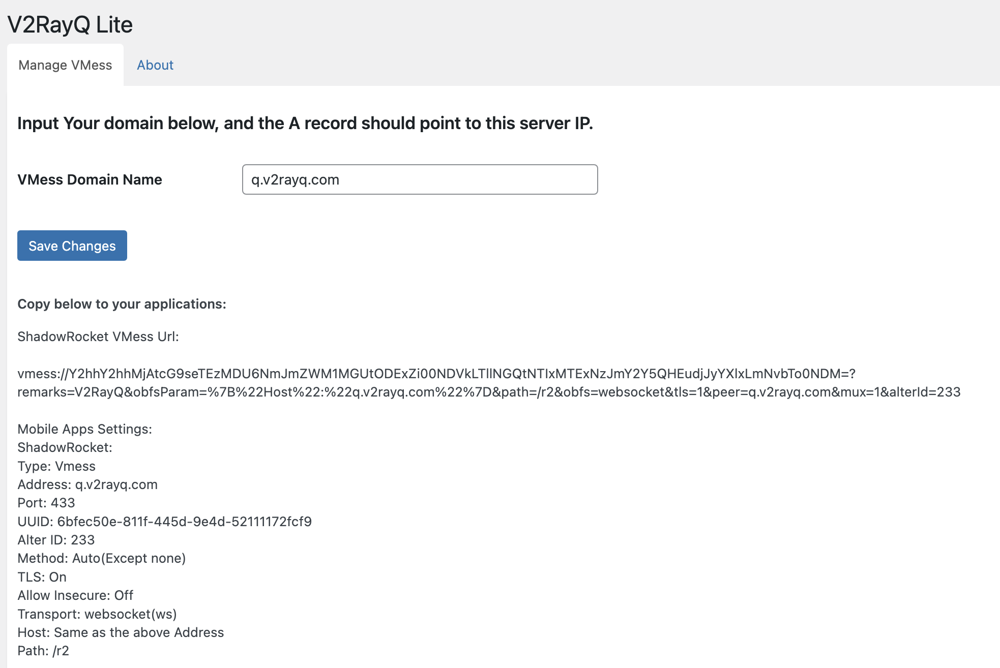

# V2RayQ Lite

V2RayQ lite is an automatic V2Ray VMess VPN generator for Wordpress.

## Features: 

* V2Ray + VMess + WebSocket + TLS.
* Undetectable VMess protcol.
* Input your domain name and then generate V2ray VMess VPN configurations.
* VMess supports Windows Linux, and Mobile applications such as Shadowrocket and V2ray* applications.
* VMess URL and detailed configurations are included.

Documentation: https://www.v2rayq.com/docs/lite 

## Changelog:

July 9, 2022
1.1.0 
* Added: Check Caddy and V2Ray wheather installed
* Added: instruction of how to install Caddy and V2Ray.
--------------------------------------------------------------
June 24, 2022
1.0.0
* Initial release 

## Screenshots 
